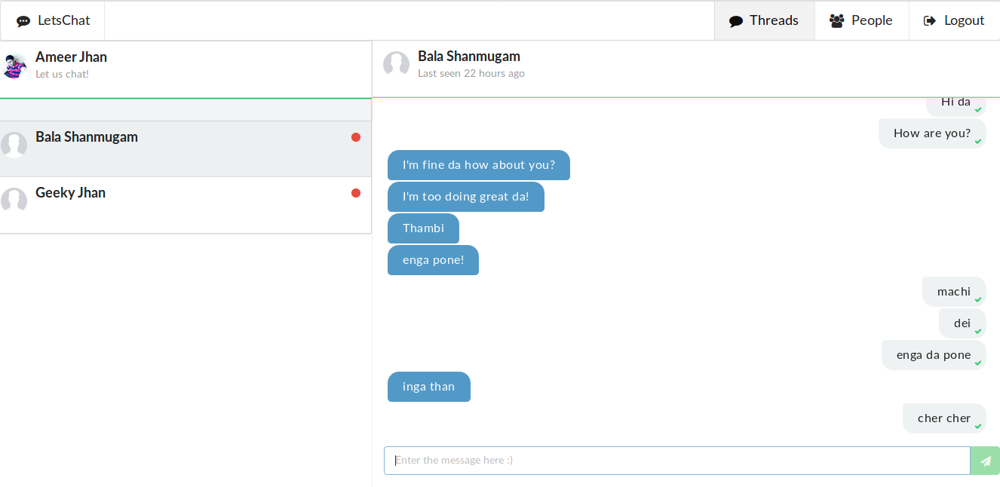

# Letschat #

Simple chat app built with __Angular__ and __Firebase__



# Demo #

See the live running app [here](http://ameerthehacker.github.io/letschat/)

# Installation #

1. Install node.js from https://nodejs.org/en/

2. Install angular-cli using the command

```
npm install -g @angular/cli
```

3. In the project folder run

```
npm install
```

4. Update firebase config if needed in __src/environments/environment.ts__

```javascript
firebaseConfig: {
    apiKey: YOUR_KEY,
    authDomain: YOUR_DOMEAIN,
    databaseURL: YOUR_URL,
    projectId: YOUR_PROJECT_ID,
    storageBucket: YOUR_BUCKET,
    messagingSenderId: YOUR_SENDER_ID
}
```


5. Start the server using the command

```
ng serve
```

6. Browse the URL __localhost:4200__ in the browser